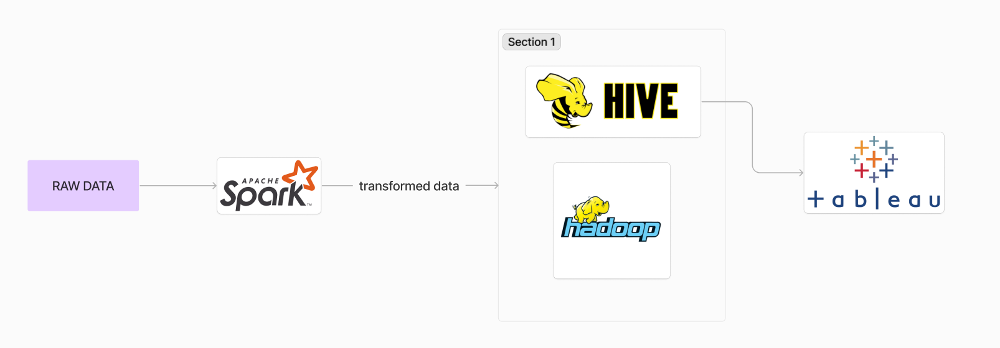

# Big-data

*This project for my assignment at my university*

## About The Project

In this project, we analyze crime data in London spanning from 2013 to 2023 to assess the relationship between social deprivation, as quantified by the Index of Multiple Deprivation (IMD), and crime rates across different Lower Super Output Areas (LSOAs). This analysis is particularly focused on data reported by two police stations: the City of London Police and the Metropolitan Police Service. This analysis aims to identify patterns and trends that provide a deeper understanding of how social deprivation influences crime.

### Data sources

Crime data: https://data.police.uk/data/

IMD Score data: https://data.cdrc.ac.uk/dataset/index-multiple-deprivation-imd#data-and-resources

### System design

### Data warehouse design (star schema)

### Output

Outputs are graphs made by Tableau 

